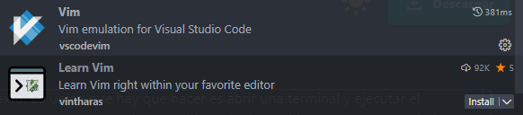
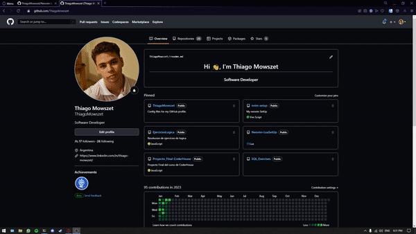

# Que es Neovim? 🤔
Neovim es un editor de texto basado en modos (uno para escribir, otro para insertar comandos, otro para visualizar y otro para insertar comandos). Es un fork de Vim, quien a su vez nacio de Vi.

# Porque lo utilizo? 🤨
Simplemente porque es mucho mas rapido que cualquier otro editor de texto que hay, como visual studio code o cualquiera de JetBrains, para poner un ejemplo.

Ademas de su velocidad, algo que me encanta es que es muy personalizable, ya que contamos con muchos plugins para instalar (como las extensiones en vsc) que son muy potentes. 

En este documento voy a detallar cuales uso, para que y como me sirven en el dia a dia como desarrollador de software.

Ademas de todo esto, cuando digo que lo utilizo ya que es rapido, no me refiero solo a su velocidad a la hora de abrir un archivo o la misma terminal.
Sino tambien, que el mismo editor nos da una serie de configuraciones (que pueden ser personalizadas, si, todo es absolutamente es personalizable) para movernos mucho mas 
rapido dentro del codigo o documento de texto. 

Por ejemplo, para movernos de forma vertical usamos las letras J y K y para movernos horizontalmente lo hacemos con H y L. 
Esto debido a que, una de las grandes razones para usar Neovim es dejar el mouse/raton de lado y solo usar el teclado para hacer todo lo que necesitemos.

En resumen, las ventajas de Neovim son: 

* Rapidez/Velocidad
* Personalizacion (todo puede ser hecho a medida)
* Todo puede ser controlado por teclado

# Lo recomendarias para usar?
Si, 100%.
> Lo unico que deberian saber es que tiene una curva de aprendizaje "larga", pero si les gusta seguramente les sea muy facil.
> Si al principio les cuesta mucho, Visual Studio code tiene una extension para simular vim y otra extension en forma de juego para aprender como funciona.

## Plugins

#### Estos son todos mis plugins, tambien los pueden encontrar en: lua/thiago/packer.lua
#### Y sus respectivas configuraciones en: after/plugin/

| Plugin | URL     | Description                       |
| :-------- | :------- | :-------------------------------- |
| `Packer`      | https://github.com/wbthomason/packer.nvim | Packer es un gestor de paquetes para descargar plugins en Neovim |
| `Telescope`| https://github.com/nvim-telescope/telescope.nvim | Telescope es un un buscador de archivos muy potente|
| `nvim-treesitter` | https://github.com/nvim-treesitter/nvim-treesitter | Proporciona funciones basicas como el highlighting del texto |
| `lsp-zero` | https://github.com/VonHeikemen/lsp-zero.nvim | Auto Completado |
| `nvim-web-devicons` | https://github.com/nvim-tree/nvim-web-devicons | Iconos para los arhivos |
| `lualine` | https://github.com/nvim-lualine/lualine.nvim | Lualine nos proporciona una barra de modos |
| `nvim-tree` | https://github.com/nvim-tree/nvim-tree.lua | NvimTree nos proporciona un explorardor de archivo |
| `autopairs` | https://github.com/windwp/nvim-autopairs | Autopairs nos automatiza los simbolos |
| `toggleterm` | https://github.com/akinsho/toggleterm.nvim | Personalmente uno de mis favoritos, nos provee de una terminal integrada |
| `gitsings` | https://github.com/lewis6991/gitsigns.nvim | Nos indica si agregamos o eliminamos lineas de codigo en nuestro workspace |
| `auto-save` | https://github.com/Pocco81/auto-save.nvim | Funciona para salvar automaticamente todos los cambios | 
| `vim-tmux-navigator` | https://github.com/christoomey/vim-tmux-navigator | Nos permite movernos a diferentes espacios de trabajo de forma comoda | 
| `vim-maximizer` | https://github.com/szw/vim-maximizer | Si estamos trabajando con dos ventanas, nos permite maximizar la actual |
| `vim-surround` | https://github.com/tpope/vim-surround | Nos permite seleccionar una palabra y agregarle los simbolos que querramos | 
| `comment` | https://github.com/numToStr/Comment.nvim | Funciona para un comentado rapido |
| `bufferline` | https://github.com/akinsho/bufferline.nvim | Gestor de ventanas | 
| `gruvbox-material` | https://github.com/sainnhe/gruvbox-material | Gruvbox es unos de mis esquemas de colores. Tiene compatibilidad con todos mis plugins y evita el color azul para dañar la vista.
| `Tokyo-night` | https://github.com/folke/tokyonight.nvim | Tokyo-night es otro scheme color.
| `barbecue` | https://github.com/utilyre/barbecue.nvim | Barbecue es una ayuda para saber donde estas parado y en que funcion/clase estas.
| `indent-blankline` | https://github.com/utilyre/barbecue.nvim | Sirve para marcar los tab y las indentaciones.
| `vim-illuminate` | https://github.com/RRethy/vim-illuminate | Ilumina palabras cuando estas son iguales.
| `nvim-ts-autotag` | https://github.com/windwp/nvim-ts-autotag | Autocompleta los tags tanto de HTML como de otros lenguajes.
| `zen-model` | https://github.com/folke/zen-mode.nvim | Zen-Mode nos sirve para concentrarnos, nos provee de un modo centrado para que las distracciones sean nulas.
| `nvim-colorizer` | https://github.com/norcalli/nvim-colorizer.lua |  Colorizer nos muestra el highlighting de los colores  
| `nvim-ts-rainbow` | https://github.com/p00f/nvim-ts-rainbow | Rainbow nos coloriza los simbolos
| `markdown-preview` | https://github.com/iamcco/markdown-preview.nvim | Markdown Preview nos permite visualizar en tiempo real los cambios que le realizamos a nuestro archivo markdown.

Ultima actualizacion de Plugs: 2023-05-21.

## Mi espacio de trabajo

#### La fuente que utilizo es: JetBrains Mono Nerd Font

